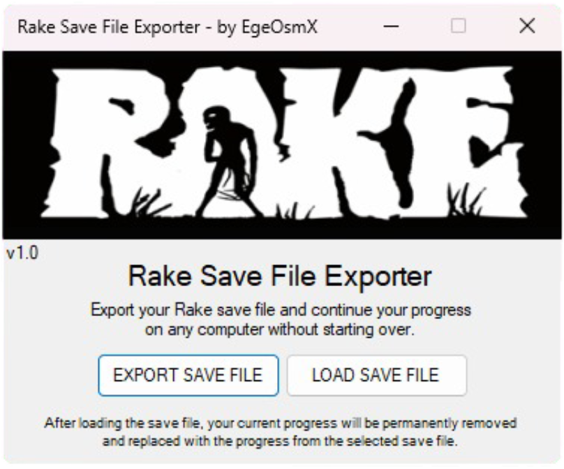
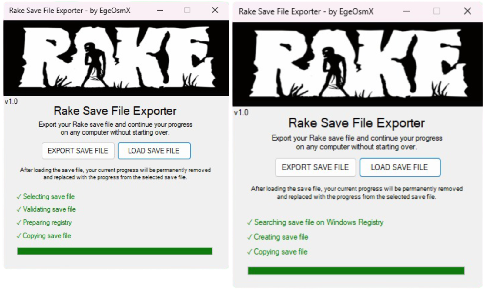

# Rake Save File Exporter

- [Tutorial Video](#tutorial-video)
- [What is Rake Save File Exporter?](#what-is-rake-save-file-exporter)
- [What is Rake?](#what-is-rake)
- [How does this tool work?](#how-does-this-tool-work)
- [Supported Systems](#supported-systems)
- [Installation](#installation)
- [Usage](#usage)

  
  

## Tutorial Video

## What is Rake Save File Exporter?

This tool allows you to **import** and **export** save files for the **Rake** game.  
Since the game does not support **Steam Cloud**, your progress is stored **locally in the Windows Registry**.

## What is Rake?

Rake is a survival, horror, and hunting game released on **Steam** by Konsordo on July 13, 2015.  
Development stopped shortly after, and Steam Cloud support was never added.  
According to a Steam review, the developer may have lost the game files, though this is not 100% confirmed.

## How does this tool work?

It is very easy to use. There are two buttons:  

- **Export Save File**  
- **Load Save File**  

### Export Save File

- Export your progress as a `.reg` file.  
- Game progress saved via Unity PlayerPrefs is stored in the **Windows Registry**, and the tool automatically finds the save files.  
- Typical use cases: transferring progress to another computer, restoring after a format, moving progress from a Cloud-PC to a local machine, etc.

### Load Save File

- Loads a `.reg` file back into the Windows Registry and restores your progress.  
- The load process deletes old progress or creates necessary folders if none exist.  
- You can manually load `.reg` files by double-clicking, but this may overwrite your current progress and corrupt the game files. **It is recommended to use the tool for restoring.**

## Supported Systems

- Windows 10 (32-bit and 64-bit)
- Windows 11 (64-bit)

Other systems are not supported and may not work correctly.

## Installation

1. Download the latest release from the [Releases](https://github.com/EgeOsmX/Rake-Save-File-Exporter/releases) page.  
2. Open `RakeSaveFileExporter.exe` (no admin rights required).

## Usage

### 1. Exporting your save file

1. Click the **EXPORT SAVE FILE** button.  
2. Select the location to save the `.reg` file in the Explorer window and optionally rename it.  
3. The tool handles the remaining steps automatically.

### 2. Restoring your save file

1. Click the **LOAD SAVE FILE** button.  
2. Select the `.reg` file in the Explorer window.  
3. The restore process is handled automatically by the tool.

 Rake is developed by Konsordo, and this project is not affiliated with them in any way.  
This project is **MIT Licensed**; attribution is required if modified.  
This is an **open-source project**.
